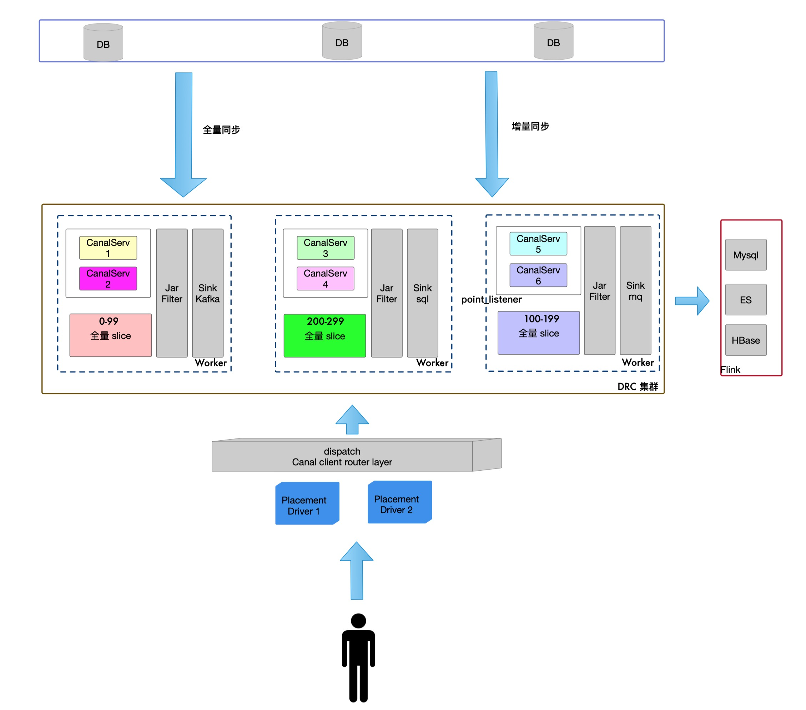

## DRC Cluster

DRC(Data Replication Center) 数据复制中心

## 功能
1. 支持 MySQL 全量 + 增量同步到各种数据源(MySQL, Kafka, RocketMQ);
2. 支持回环同步

## PD
Placement Driver

全局中心节点(调度 worker 的中心节点)

## Worker

Worker(执行任务的工作节点)

# 设计

## 扩容
当新增 pod 时， 会像 db 注册 ip:port
用户手动触发 autoRebalance 操作后, 系统会将任务平均的分配在所有的 pod 上. 

## 缩容
WorkerHealthCheckTask 定时任务会每秒检测 worker 的健康接口， 如果 pod 连接失败， 就会删除这个 worker 下的所有任务，并执行 rebalance。

## 故障自愈
AutoRecoverTask 定时任务，固定间隔调度一次，发现数据库状态是运行时，但是 RPC 状态是异常的任务，会进行重启操作。

## 节点宕机
同缩容；

## 自动均衡
每次重新 re balance时，都会计算平均值，使每个 worker 的 task 数量，都尽量在平均值附近; 参见 LoadBalancer 接口的实现类.

## 组件依赖
1. Zookeeper(增量同步必须, 用于 Canal 分布式协调)
2. MySQL(必须, 持久化配置, 任务注册, 心跳持久化)
3. RocketMQ(当前是必须的, 增量回放前的存储,后续可使用其他代替)
4. Redis(必须, 分布式限流, 分布式锁)
5. Apollo(可选, 没有的话就是静态配置)

## 开源协议

- [Apache License 2.0](LICENSE)

## 致谢

本项目基于 canal 项目二次开发而来, 感谢 [canal](https://github.com/alibaba/canal) 项目和 canal 的开发者.

本项目使用 jetbrains IDEA 工具开发, 感谢 jetbrains 提供如此高效率的开发工具!
